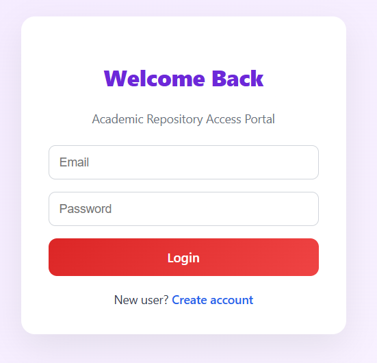
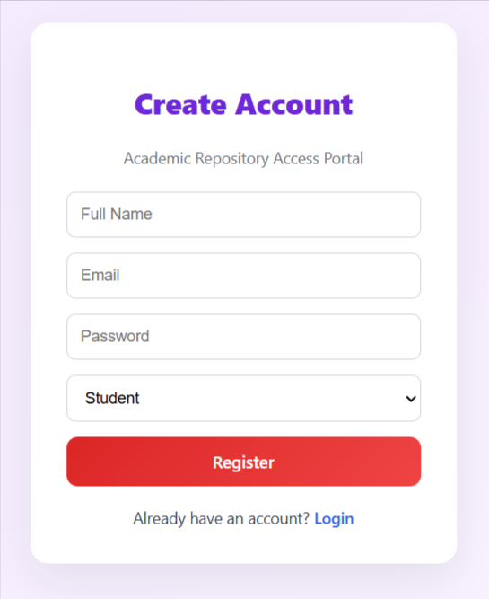
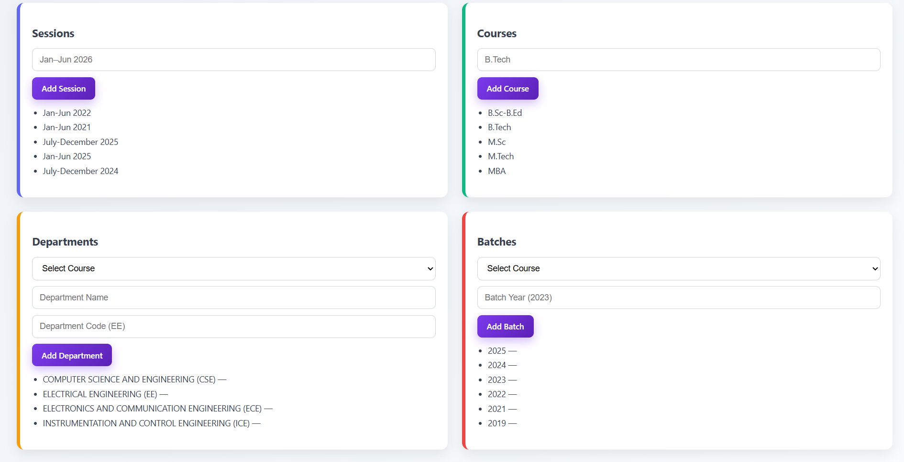
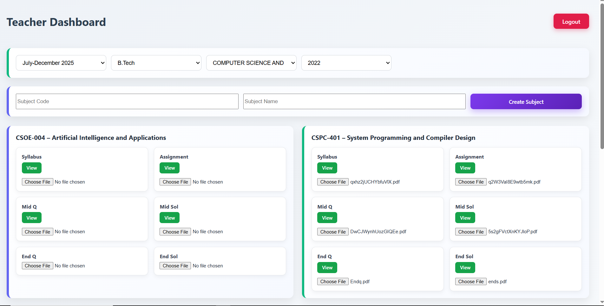
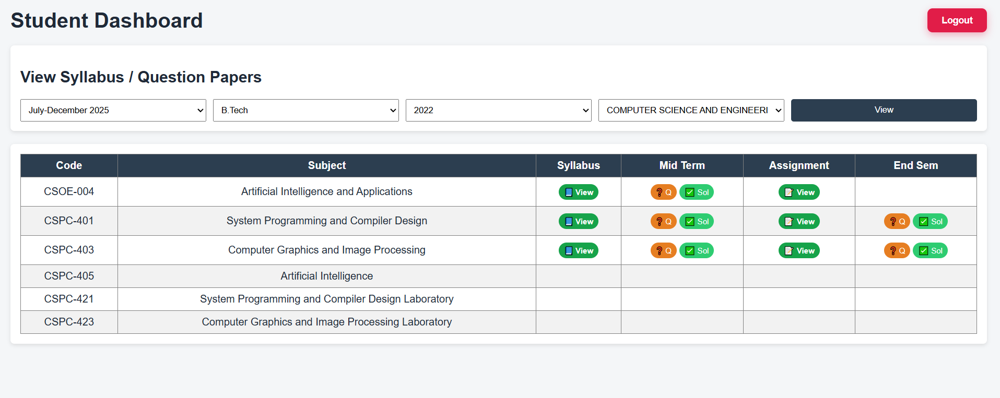

# 📚 Academic Repository System

A full-stack academic resource management platform designed for **universities and colleges** to manage **syllabi, question papers, solutions, assignments**, and other academic documents in a **structured, role-based** manner.

This project was built for **learning, system design practice, and real-world backend/frontend experience**.

---

## 🚀 Features

### 👨‍💼 Admin
- Create & manage:
  - Academic Sessions (e.g. Jan–Jun 2026)
  - Courses (B.Tech, M.Tech, MBA, etc.)
  - Departments (CSE, ECE, EE, etc.)
  - Batches (2021, 2022, 2023)
- Full control over academic structure

### 👩‍🏫 Teacher
- Create subjects under selected academic scope
- Upload PDFs for:
  - Syllabus
  - Mid-term Question Paper
  - Mid-term Solution
  - Assignment / Quiz
  - End-semester Question Paper
  - End-semester Solution
- View & replace uploaded files
- Teachers can see **only subjects created by them**

### 👨‍🎓 Student
- Filter academic resources by:
  - Session
  - Course
  - Department
  - Batch
- View and download:
  - Syllabus
  - Question papers
  - Solutions
  - Assignments

### 🔐 Authentication & Security
- JWT-based authentication
- Role-based access control (Admin / Teacher / Student)
- Secure file storage using Cloudinary
- Private repository (copyright-safe)

---

## 🛠 Tech Stack

### Frontend
- React.js
- React Router
- Axios
- Modern CSS (custom dashboard UI)

### Backend
- Node.js
- Express.js
- MongoDB (MongoDB Atlas)
- Mongoose
- JWT Authentication

### File Storage
- Cloudinary (PDF storage)

---

## 📸 Screenshots

### 🏠 Landing Page

---

### 🔐 Login 

---
### 🔐 Register

---

### 👨‍💼 Admin Dashboard

---

### 👩‍🏫 Teacher Dashboard

---

### 👨‍🎓 Student Dashboard

---

